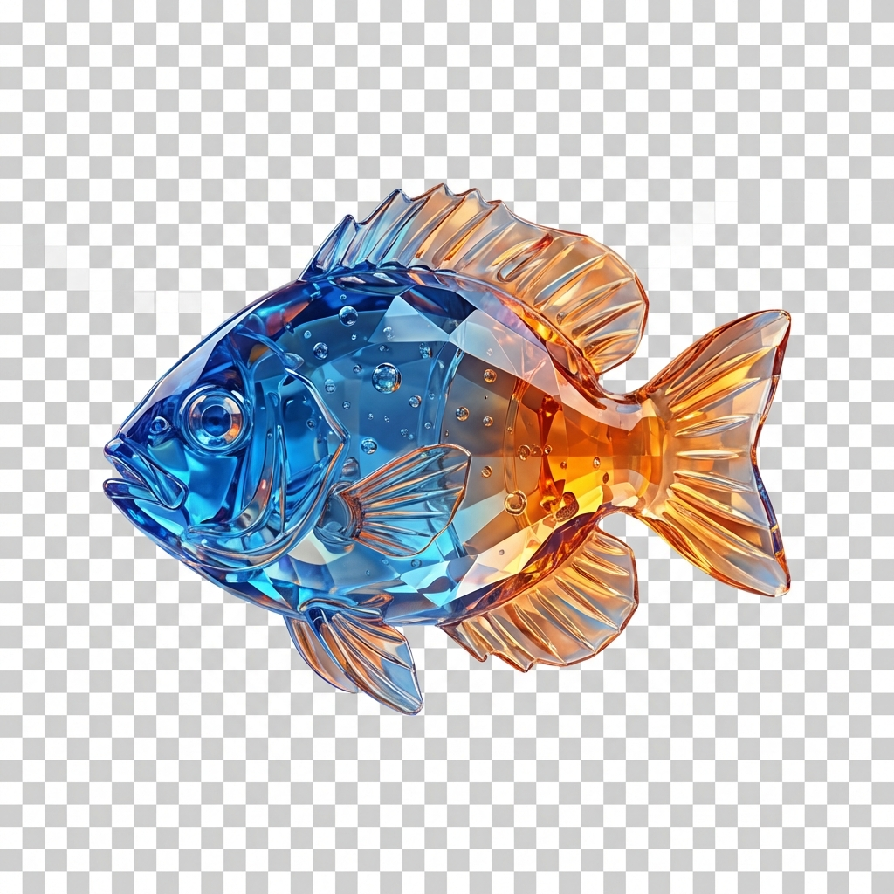
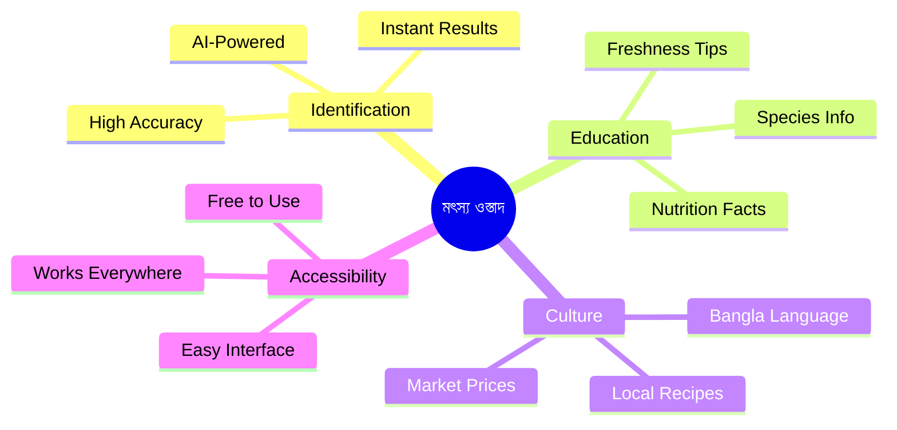
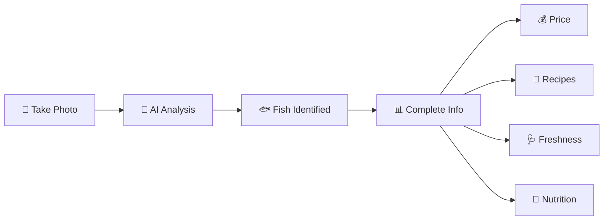
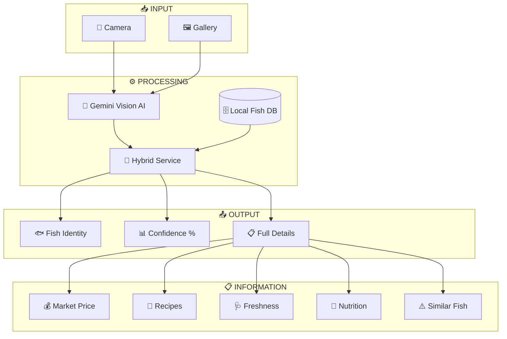
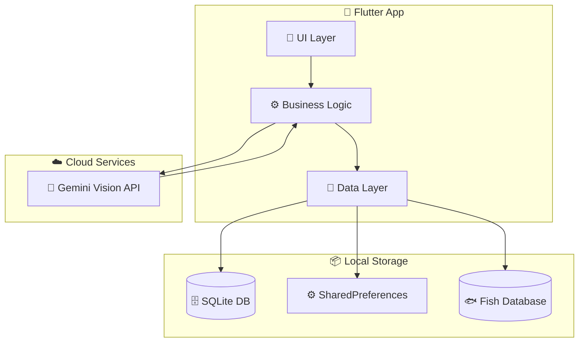
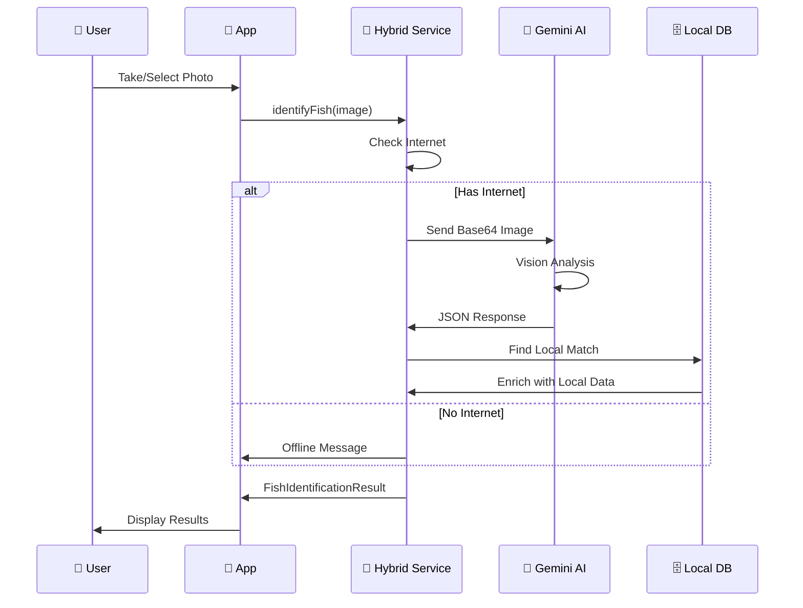
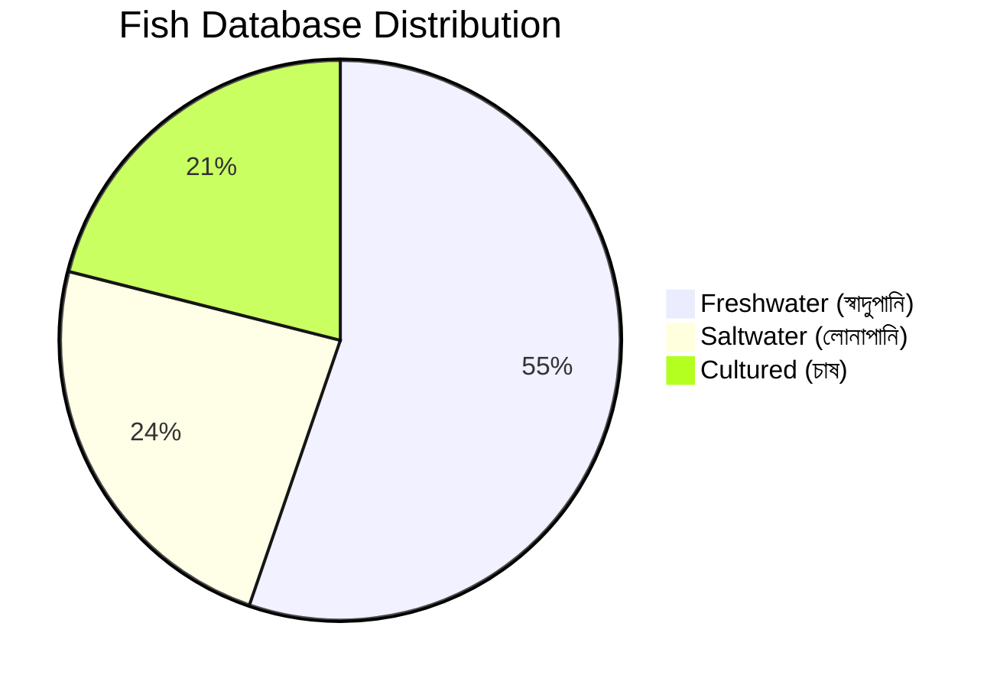
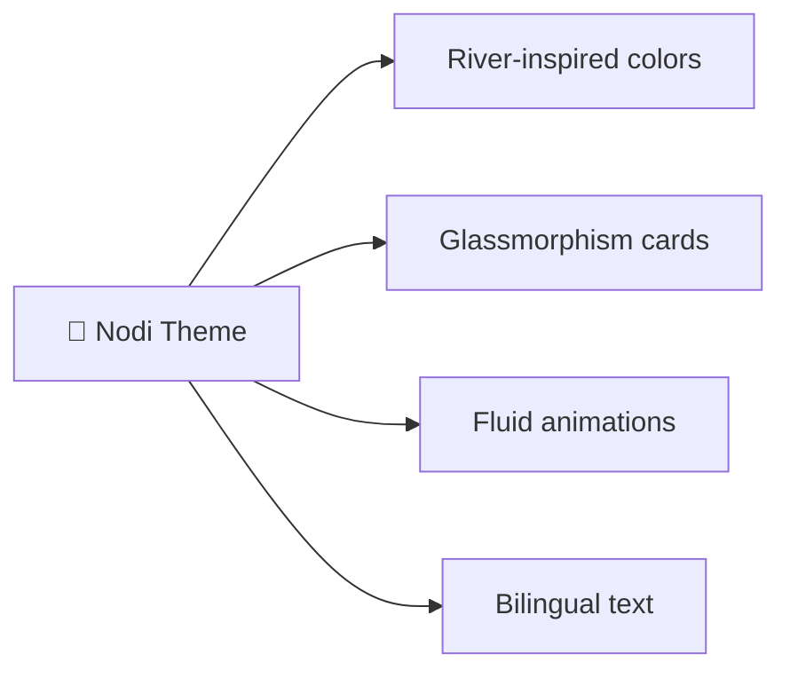
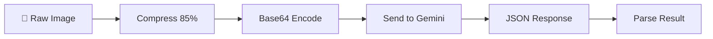
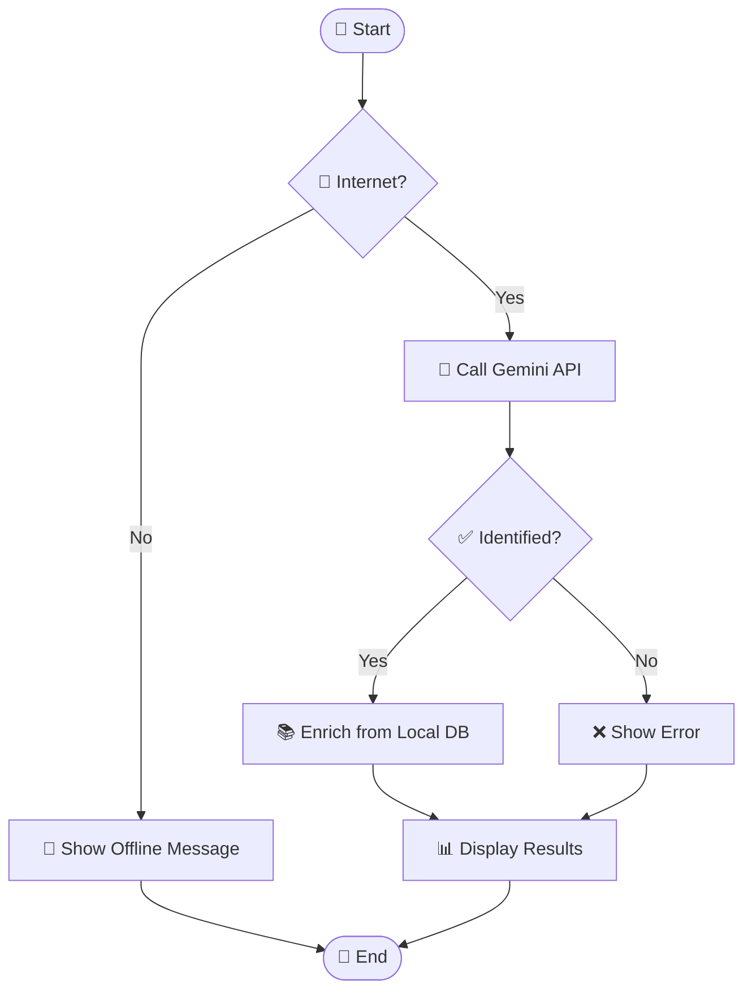

<p align="center">
  
</p>

<h1 align="center">মৎস্য ওস্তাদ (Matsho Ostad)</h1>

<p align="center">
  <strong>🐟 AI-Powered Fish Identification for Bangladesh</strong>
</p>

<p align="center">
  
  
  
  
</p>

<p align="center">
  
  
  
</p>

---

## 📖 Table of Contents

- [🎯 Project Vision](#-project-vision)
- [💡 Why This Project?](#-why-this-project)
- [🌟 Features](#-features)
- [📱 App Screenshots](#-app-screenshots)
- [🏗️ System Architecture](#️-system-architecture)
- [🔬 Technical Implementation](#-technical-implementation)
- [🐟 Fish Database](#-fish-database)
- [🎨 UI/UX Design](#-uiux-design)
- [⚙️ Installation](#️-installation)
- [🔧 Configuration](#-configuration)
- [📊 Algorithms & Techniques](#-algorithms--techniques)
- [🗺️ Roadmap](#️-roadmap)
- [🤝 Contributing](#-contributing)
- [📄 License](#-license)

---

## 🎯 Project Vision

**মৎস্য ওস্তাদ (Matsho Ostad)** - meaning "Fish Expert" in Bangla - is an AI-powered mobile application designed to help Bangladeshi consumers, fishermen, and fish enthusiasts instantly identify fish species using just their smartphone camera.

> "Empowering every Bangladeshi to become a fish expert with the power of AI"

### Core Objectives



---

## 💡 Why This Project?

### The Problem

Bangladesh is the **3rd largest inland fish producer** in the world, with over **260+ freshwater fish species**. However:

| Challenge | Impact |
|-----------|--------|
| 🎣 **Species Confusion** | Consumers often confuse similar-looking fish and pay wrong prices |
| 💰 **Price Exploitation** | Without proper identification, vendors can overcharge |
| 🍽️ **Cooking Mismatch** | Wrong fish = wrong recipe = wasted meal |
| 🩺 **Freshness Issues** | People don't know how to check if fish is fresh |
| 📚 **Knowledge Gap** | Traditional fish knowledge is being lost |

### Our Solution



---

## 🌟 Features

### Core Features

| Feature | Description | Status |
|---------|-------------|--------|
| 📸 **Smart Scan** | Identify fish from camera or gallery | ✅ |
| 🤖 **Gemini AI** | Google's latest Vision AI for accurate results | ✅ |
| 🇧🇩 **Bilingual UI** | Full Bangla + English interface | ✅ |
| 💰 **Market Prices** | Current BDT prices per kg | ✅ |
| 🍛 **Recipes** | Traditional Bangla cooking suggestions | ✅ |
| 🩺 **Freshness Guide** | How to check if fish is fresh | ✅ |
| 💪 **Nutrition Info** | Calories, protein per 100g | ✅ |
| 🔊 **TTS Speaker** | Hear Bangla fish names pronounced | ✅ |

### Advanced Features

| Feature | Description | Status |
|---------|-------------|--------|
| 📍 **GPS Catch Map** | Log where you caught/bought fish | ✅ |
| 🎨 **3 Color Themes** | Ocean Blue, Sunset Orange, Forest Green | ✅ |
| 🔗 **Social Share** | Share to WhatsApp/Facebook | ✅ |
| 🔔 **Daily Fish Facts** | Push notifications with fun facts | ✅ |
| 🏠 **My Aquarium** | Personal collection of identified fish | ✅ |
| ⚠️ **Confusion Breaker** | Explains why it's NOT a similar fish | ✅ |
| 🔄 **Human-in-Loop** | Report wrong identifications | ✅ |

### Feature Diagram



---

## 📱 App Screenshots

<p align="center">
  <i>Screenshots coming soon after APK build</i>
</p>

| Home Screen | Scanning | Results | Catch Map |
|-------------|----------|---------|-----------|
| 🏠 | 🔍 | 📊 | 🗺️ |

---

## 🏗️ System Architecture

### High-Level Architecture



### Project Structure

```
lib/
├── core/
│   ├── config/
│   │   └── api_config.dart          # API keys configuration
│   ├── data/
│   │   └── fish_database.dart       # 50+ Bangladeshi fish data
│   ├── services/
│   │   ├── database_service.dart    # SQLite operations
│   │   ├── gemini_fish_service.dart # Gemini AI integration
│   │   ├── hybrid_fish_service.dart # Offline/Online hybrid
│   │   └── notification_service.dart # Push notifications
│   ├── theme/
│   │   ├── app_colors.dart          # Color palettes
│   │   ├── app_theme.dart           # Material theme
│   │   └── theme_provider.dart      # Theme state management
│   └── widgets/
│       ├── animated_splash_screen.dart
│       ├── fluid_background.dart    # Animated gradient
│       ├── glass_container.dart     # Glassmorphism cards
│       ├── glass_drawer.dart        # Side menu
│       └── mobile_wrapper.dart      # Responsive wrapper
├── features/
│   ├── history/
│   │   ├── data/
│   │   │   ├── history_repository.dart
│   │   │   └── scan_history_model.dart
│   │   └── presentation/
│   │       └── aquarium_screen.dart
│   ├── home/
│   │   └── presentation/
│   │       └── home_screen.dart
│   ├── map/
│   │   └── presentation/
│   │       └── catch_map_screen.dart
│   └── scanner/
│       └── presentation/
│           ├── result_screen.dart
│           ├── scanner_screen.dart
│           └── widgets/
│               └── bio_sonar_scanner.dart
└── main.dart
```

---

## 🔬 Technical Implementation

### AI Pipeline



### Gemini AI Prompt Engineering

The AI prompt is carefully crafted for accuracy:

```
┌─────────────────────────────────────────────────────────────┐
│  GEMINI PROMPT STRUCTURE                                    │
├─────────────────────────────────────────────────────────────┤
│  1. Role: Expert ichthyologist (Bangladeshi fish)           │
│  2. Task: Analyze image, identify species                   │
│  3. Output: Structured JSON with 15+ fields                 │
│  4. Validation: Reject toys, drawings, blurry images        │
│  5. Confidence: Honest scoring (0.0 - 1.0)                  │
│  6. Similar Fish: Always explain confusion with other fish  │
└─────────────────────────────────────────────────────────────┘
```

### Key Technical Decisions

| Decision | Choice | Rationale |
|----------|--------|-----------|
| **State Management** | Riverpod | Type-safe, testable, performant |
| **Database** | SQLite + FFI | Works on mobile + web |
| **AI Service** | Gemini 1.5 Flash | Fast, accurate, multilingual |
| **UI Framework** | Flutter | Cross-platform, beautiful UI |
| **Animations** | Custom Controllers | Smooth, branded experience |
| **Map Provider** | OpenStreetMap | Free, no API key needed |

---

## 🐟 Fish Database

### Database Statistics

```
📊 FISH DATABASE SUMMARY
━━━━━━━━━━━━━━━━━━━━━━━━━━━━━━━━━━━━━━━━
Total Species:      38+
Categories:         3 (Freshwater, Saltwater, Cultured)
Data Fields:        15 per fish
Total Data Points:  500+
━━━━━━━━━━━━━━━━━━━━━━━━━━━━━━━━━━━━━━━━
```

### Fish Categories



### Sample Fish Data Structure

```dart
FishData(
  id: 'hilsa',
  nameBangla: 'ইলিশ',
  nameEnglish: 'Hilsa',
  scientificName: 'Tenualosa ilisha',
  habitat: 'Saltwater/Freshwater',
  priceRange: '৳800-2500/kg',
  cookingMethods: ['Bhapa', 'Shorshe', 'Fry'],
  freshnessChecklist: ['Bright silver', 'Red gills', 'Firm belly'],
  recipes: ['শর্ষে ইলিশ', 'ভাপা ইলিশ', 'ইলিশ পাতুরি'],
  calories: '273 kcal/100g',
  protein: '19.4g/100g',
)
```

---

## 🎨 UI/UX Design

### Design Philosophy



### Color Themes

| Theme | Primary | Accent | Inspiration |
|-------|---------|--------|-------------|
| 🌊 **Ocean Blue** | `#004E64` | `#7AE7C7` | Deep rivers of Bangladesh |
| 🌅 **Sunset Orange** | `#2D1B00` | `#FFAB40` | Sunset over Padma River |
| 🌲 **Forest Green** | `#1B3A2F` | `#81C784` | Sundarbans mangroves |

### UI Components

| Component | Description |
|-----------|-------------|
| **Fluid Background** | Animated gradient with floating particles |
| **Glass Container** | Frosted glass effect cards |
| **Bio-Sonar Scanner** | Radar-style scanning animation |
| **Bubble Splash** | Result reveal with rising bubbles |

---

## ⚙️ Installation

### Prerequisites

- Flutter SDK 3.22+
- Dart SDK 3.0+
- Android Studio / VS Code
- Gemini API Key

### Setup Steps

```bash
# 1. Clone the repository
git clone https://github.com/yourusername/matsho-ostad.git
cd matsho-ostad

# 2. Install dependencies
flutter pub get

# 3. Configure API key (see Configuration section)

# 4. Run the app
flutter run
```

---

## 🔧 Configuration

### Gemini API Key Setup

1. Get your API key from [Google AI Studio](https://makersuite.google.com/app/apikey)

2. Edit `lib/core/config/api_config.dart`:

```dart
class ApiConfig {
  static const String geminiApiKey = 'YOUR_API_KEY_HERE';
  static bool get isConfigured => geminiApiKey != 'YOUR_API_KEY_HERE';
}
```

> ⚠️ **Security Note**: Never commit your API key to public repositories!

---

## 📊 Algorithms & Techniques

### 1. Image Processing Pipeline



### 2. Confidence Scoring

```
CONFIDENCE LEVELS
━━━━━━━━━━━━━━━━━━━━━━━━━━━━━━━━━
90-100%  →  High Confidence    ✅
70-89%   →  Medium Confidence  ⚠️
50-69%   →  Low Confidence     ⚡
<50%     →  Identification Failed ❌
━━━━━━━━━━━━━━━━━━━━━━━━━━━━━━━━━
```

### 3. Hybrid Identification Flow



### 4. Data Enrichment Algorithm

```python
# Pseudocode
def enrich_result(gemini_result):
    local_fish = database.find_by_name(gemini_result.name)
    
    if local_fish:
        # Merge local data (always up-to-date prices)
        result.price = local_fish.price
        result.recipes = local_fish.recipes
        result.freshness = local_fish.freshness
        result.nutrition = local_fish.nutrition
    
    return result
```

---

## 🗺️ Roadmap

### Completed ✅

- [x] Gemini AI Integration
- [x] 50+ Fish Database
- [x] Bilingual UI
- [x] GPS Catch Map
- [x] Push Notifications
- [x] 3 Color Themes
- [x] Social Sharing

### Upcoming 🚧

- [ ] True Offline Mode (TFLite)
- [ ] AR Fish Overlay
- [ ] Fish Market Finder
- [ ] Community Corrections
- [ ] Voice Commands

---

## 🤝 Contributing

Contributions are welcome! Please read our contributing guidelines first.

1. Fork the repository
2. Create your feature branch (`git checkout -b feature/amazing-feature`)
3. Commit changes (`git commit -m 'Add amazing feature'`)
4. Push to branch (`git push origin feature/amazing-feature`)
5. Open a Pull Request

---

## 👨‍💻 Author

**Your Name**
- GitHub: [@yourusername](https://github.com/yourusername)

---

## 📄 License

This project is licensed under the MIT License - see the [LICENSE](LICENSE) file for details.

---

## 🙏 Acknowledgments

- Google Gemini AI for fish identification
- Flutter community for amazing packages
- Bangladeshi fisheries data sources
- All contributors and testers

---

<p align="center">
  <strong>Made with ❤️ in Bangladesh 🇧🇩</strong>
</p>

<p align="center">
  
</p>
